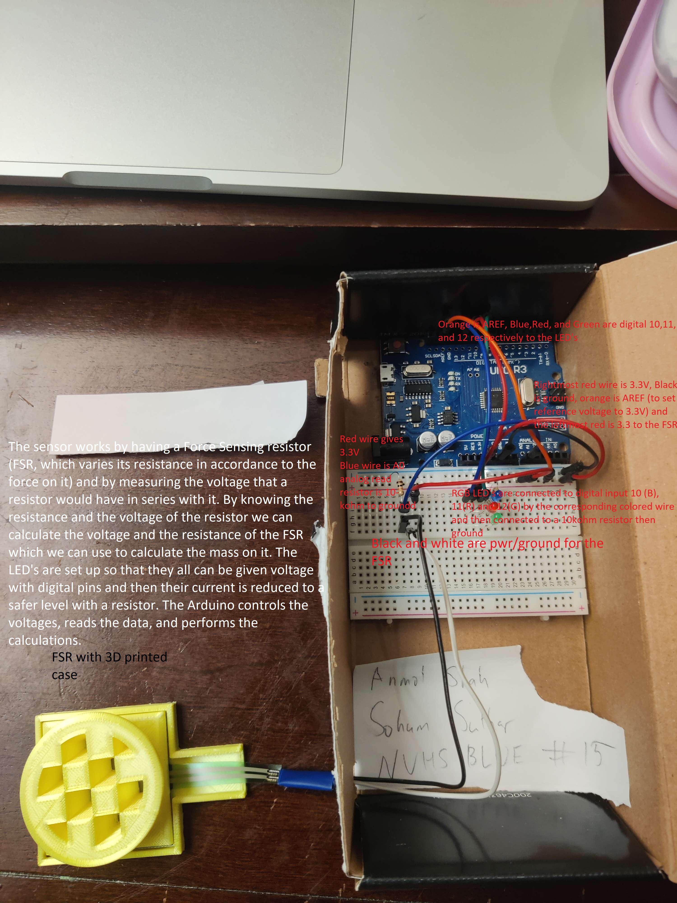

# Science Olympiad Detector Building (2022-2023)

An Arduino-based mass detector built for the Science Olympiad "Detector Building" event. The device measures the mass of objects using a Force Sensing Resistor (FSR), converts the analog voltage reading into a mass estimate via calibrated curve-fit equations, and signals the detected mass range through an RGB LED.



## How It Works

1. A **Force Sensing Resistor (FSR)** is connected in a voltage divider circuit with a ~9.72k ohm reference resistor.
2. The Arduino reads the analog voltage from the FSR on pin A0 using an external 3.3V analog reference.
3. The raw ADC reading is converted to voltage, then mapped to mass (in grams) using **piecewise exponential/linear curve-fit equations** derived from physical calibration data.
4. An **RGB LED** lights up to indicate which mass range the object falls into:
   - **Green:** low mass range
   - **Blue:** mid mass range
   - **Red:** high mass range
5. Voltage and mass readings are printed to the serial monitor at 19200 baud for debugging.

## Repository Structure

```
main/main.ino          - Primary Arduino sketch (with ADC oversampling)
STATE/STATE.ino        - State competition variant (different calibration curves)
linearizations/        - Vernier Graphical Analysis calibration data files (.gambl)
detectorimage.jpg      - Photo of the assembled detector hardware
```

## Hardware Requirements

- Arduino Uno (or compatible ATmega-based board)
- Force Sensing Resistor (FSR)
- ~9.72k ohm resistor (for voltage divider)
- RGB LED (common cathode) with current-limiting resistors
- 3.3V reference voltage connected to the Arduino AREF pin
- Breadboard and jumper wires

### Pin Connections

| Component | Arduino Pin |
|-----------|-------------|
| FSR (via voltage divider) | A0 |
| Red LED | D11 |
| Green LED | D10 |
| Blue LED | D12 |

## Getting Started

### Prerequisites

- [Arduino IDE](https://www.arduino.cc/en/software) (or Arduino CLI)
- **Oversampling** library (required for `main/main.ino`):
  - Install via Arduino IDE: *Sketch > Include Library > Manage Libraries*, then search for "Oversampling"

### Upload

1. Open `main/main.ino` (or `STATE/STATE.ino` for the state competition variant) in the Arduino IDE.
2. Select your board (e.g., Arduino Uno) and port.
3. Click **Upload**.
4. Open the Serial Monitor at **19200 baud** to view live voltage and mass readings.

## Sketches

### `main/main.ino`

The primary sketch. Uses the `Oversampling` library for improved ADC resolution (10-bit to 15-bit). LED thresholds are set for three mass ranges: green (0-100g), blue (101-140g), and red (141-1000g).

### `STATE/STATE.ino`

An alternate sketch tuned for a specific state competition setup. Uses raw `analogRead()` averaging (20 samples) instead of the Oversampling library, and has different piecewise curve-fit equations and LED threshold ranges optimized for that competition's conditions.

## Calibration Data

The `linearizations/` directory contains `.gambl` files from **Vernier Graphical Analysis** software. These files store the raw voltage-vs-mass calibration datasets and the curve-fit results used to derive the equations in `getg()`. To recalibrate for different hardware, collect new data points and fit new curves using Graphical Analysis or similar tools, then update the coefficients in `getg()`.
